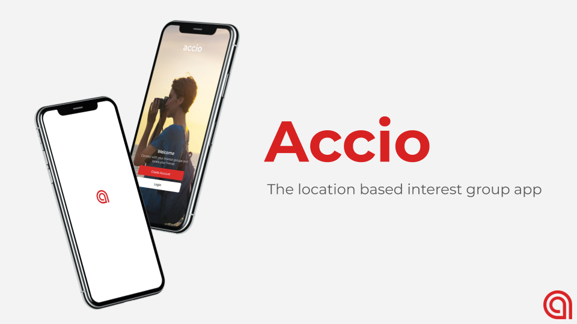

# Accio

Location-based interest groups app built with (MERN stack) React Native, Redux, MongoDB, Node.js, Express.js

---

### Note to Major League Hacking (MLH) mentor viewing this
* For easy viewing of codes and files I contributed, I put my initials beside the name of the folders and files. <em>Example: App(PTK).js</em>
* In each of those files you will see code blocks enclosed with comments with my initials. This indicates the pieces of codes I wrote.
* This branch <em>(my-contributions-comments)</em> may not run locally due to some file names being replaced by appending my initials. To run locally, please either use <em>master</em> or <em>end-of-semester-version</em> branches. Instructions are given there.
* The implementations for this branch of the app are identical to <em>end-of-semester-version</em> branch.

---

## Summary of Accio

### Pitch
> Our app seeks to address the never ending need to find community. Even without quarantine, there is a global epidemic of people feeling isolated from one another. Where are you supposed to go to find YOUR people? Which bar, which park, which record store are you supposed to go to? Instead of you hopping cafe to cafe hoping that you’ll run into someone with your eclectic taste in coffee, our app brings them to you. Our app lets you join groups of people with similar interests and find where they are in the moment. Unlike other event and group based apps, Accio thrives in the <strong>right now</strong>. Any app can tell you what is going on next Friday, or what event you missed yesterday, but only Accio will tell you which friends want to do something <strong>right now</strong>. - <em>credits to Casey Mason</em>

### Product Overview
* Join interest groups or create your new group
* Connect with people 
* Create a future event 
* RSVP to an upcoming event
* Post a discussion 
* <strong>Go Live</strong> when you are doing an activity 
* Leave the group


### Team
 Accio is founded and developed by 9 people for CSE437S - Software Engineering Workshop course at Washington University in St. Louis. The app was built from January - May 2020.
* Steven Lee (Product Manager)
* **Pyi Theim Kyaw(PTK) (Developer + Build Master)** 
* Developer
  - Minh Vu
  - Casey Mason
  - Linghan Zhu
  - Khin Wai Phyo Han
  - Kaity Clark
* User tester
  - Hamish McGregor

### My responsibilities
* Code review
* Report directly to the Product Manager and the professor with various issues
* Resolve merge conflicts and other git-related issues
* Features I implemented
  - Skeleton and frontend architecture of the app
  - Friend activities - add, delete, unfriend
  - Profile page
  - Map
  - Authentication (Login, Signup, etc...)

### Detailed Tech Stack
* MERN stack
  - MongoDB to utilize NoSQL database
  - ExpressJS for API endpoints
  - React Native for cross-platform app development
  - NodeJS server running on AWS EC2 instance
* ReduxJS for frontend state management
* Native Base - cross-platform UI components for the frontend

---
### Resources
* Screenshots of the app - [Final presentation slides](https://docs.google.com/presentation/d/1xH85xuupOnM_y-9ROJqRBbR5FuDyiuowwnDrFzF5Mmw/edit?usp=sharing)
* Run the app locally
  - Frontend
    - Clone the repository
    ```
    cd Accio/frontend
    npm install
    npm start
    ```
    - Expo should be launched on your favorite browser
    - Run the app on the simulator or scan the QR code after downloading [Expo Client](https://apps.apple.com/us/app/expo-client/id982107779) App.
  - Backend
    - Note: You do not need to run the backend code since the backend server is live.
    - If you wish to run the backend, follow the instructions below:
    ```
    cd Accio/backend
    npm install
    npm start
    ```
    - [Download and install MongoDB Community](https://www.mongodb.com/download-center/community)
    ```
    cd Downloads #or direct yourself to where the tar file was downloaded

    #Move the file to your home directory
    mv mongodb-osx-x86_64-3.0.7.tgz ~/ 

    cd ~/

    #Extract the file
    tar -zxvf mongodb-osx-x86_64-3.0.7.tgz 

    #Change the name so it's more readable
    mv mongodb-osx-x86_64-3.0.7 mongodb 

    #Create two directories in your root directory. May have to run with sudo.
    mkdir -p /data/db 

    #Change persmissions
    sudo chown -R `id -un` /data/db  

    #Start the server
    ~/mongodb/bin/mongod 
    ```
    - Make sure to change the baseURL in Constants.js file from the frontend to your public IP serving on port 8080.


